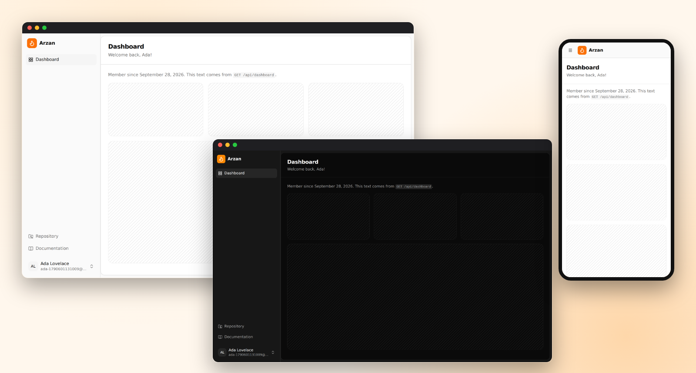

<p align="center">
  
  <br><sub>The dashboard right after installing: desktop and phone, light and dark.</sub>
</p>

# Flarekit

**A Laravel-style starter kit for full-stack apps on Cloudflare's free tier: auth, database, tests and one-command deploy, for $0/month.**

"Laravel-style" means the conventions, not PHP: accounts, starter layouts, settings and tests are ready on day one, there's one obvious place for everything, and deploying is one command. Underneath it's TypeScript: React + Vite + TanStack Router/Query + shadcn/ui on the front, Hono + D1 + Drizzle + Better Auth on the back, all served by **one Cloudflare Worker**. You own every line.

```sh
npm create cloudflare@latest -- my-app --template=hammadzafar05/flarekit
```

[](https://deploy.workers.cloudflare.com/?url=https://github.com/hammadzafar05/flarekit) · **Live demo:** _coming soon_ · [Quick start](#quick-start) · [Roadmap](#roadmap)

### Why Flarekit

- **$0 hosting for real apps.** Pages are static assets (free and unlimited); only `/api/*` runs the Worker. Password hashing is tuned for the Free plan's 10 ms CPU limit.
- **Made for AI coding agents.** `AGENTS.md` gives Claude Code, Cursor or Codex the architecture and the rules, so "build me a feature" stays secure and on the free tier.
- **Tests against a real database.** API tests run against an in-memory D1 (not mocks), plus Playwright tests on desktop and phone that **fail on any CSP violation**.
- **Secure by default:** PBKDF2 passwords, revocable sessions, CSRF protection, per-IP rate limits, a strict CSP and safe redirects.
- **Migrations apply themselves.** Edit the schema, run `npm run db:generate`, deploy. The Worker migrates on its first request.

### What's included

| | |
|---|---|
| **Accounts** | Register, log in, log out, remember me, forgot / reset password, email verification, change password, delete account, see and sign out other sessions, per-IP rate limiting |
| **App shell** | Sidebar *or* header layout, three sign-in page styles, dashboard, settings (profile, password, sessions, appearance), light / dark / system theme, responsive to phone width |
| **Backend** | Hono API with a `requireUser` middleware, D1 via Drizzle (typed schema, generated migrations that apply themselves on deploy), pluggable email (console in dev, Resend in production) |
| **Quality** | Strict TypeScript, Biome, API tests on a real local D1, Playwright end-to-end tests (desktop + mobile), GitHub Actions CI |
| **AI-ready** | `AGENTS.md` explains the architecture and conventions to coding agents (Claude Code, Cursor, Codex…) |

## Built with Flarekit

Built something with Flarekit? Share it in [Discussions](https://github.com/hammadzafar05/flarekit/discussions) and it can be featured here.

## Coming from Laravel or Inertia?

| Laravel | Flarekit |
|---|---|
| `routes/web.php` + controllers | Pages: file routes in `src/routes/` (TanStack Router). API: Hono routers in `worker/routes/` |
| Blade / Inertia pages | A React app built once into static files; pages fetch JSON from `/api/*` with TanStack Query |
| Form Requests | Zod schemas; errors come back as `{ error: "…" }` and are shown as they are |
| Eloquent + migrations | Drizzle schema, `npm run db:generate`; migrations apply on the first request |
| `DB::transaction()` | `db.batch([...])` (one D1 transaction: validate first, then write in one go) |
| Breeze / Fortify | Better Auth; `requireUser` middleware is the `auth` middleware |
| `php artisan test` | `npm test` (Vitest + real in-memory D1), `npm run test:e2e` (Playwright) |
| A server to pay for | Cloudflare's free tier |

## Why it fits the free tier

| Free-plan limit | How Flarekit stays inside it |
|---|---|
| 100,000 Worker requests / day | The app is a single-page app served as **static assets, which are free and unlimited**. Only `/api/*` calls run the Worker (`run_worker_first`). |
| 10 ms CPU per request | Better Auth's default password hashing on Workers is pure-JS scrypt (~150 ms) and can fail sign-ups with "exceeded CPU limit". Flarekit plugs in **native WebCrypto PBKDF2** (~20 ms, already running in production on the Free plan) — only sign-up, sign-in and password changes hash; every other request is cheap. |
| D1: 5 M row reads, 100 k writes / day, 500 MB | Sessions are one indexed lookup per request; rate-limit state is a single row per IP and endpoint. Add indexes for anything you filter on. |
| Worker size 3 MB (gzipped) | The Worker bundle is ~370 KB gzipped. |

**Email** isn't free on Cloudflare. Locally, emails (with their links) print to the terminal. On a deployed site, add a [Resend](https://resend.com) key (free tier: 3,000 emails/month) or swap in another provider in `worker/email/index.ts`. Until then, a deployed app sends nothing and **never writes reset or verification links to your logs**. The UI tells users that password-reset email isn't set up, and hides the "verify your email" nag.

## Security defaults

| | |
|---|---|
| Passwords | PBKDF2-SHA256, 100,000 iterations (the Workers maximum), random salt. OWASP recommends more (600k), but Workers caps PBKDF2 at 100k; the iteration count is stored per hash so it can be raised later |
| Sessions | HttpOnly, Secure, SameSite cookies; server-side sessions you can list and revoke; password reset or change can sign out every device |
| CSRF | `csrf()` on every API route (blocks cross-site form posts, including login CSRF) plus no CORS headers (blocks cross-site JSON) |
| Rate limits | Per client IP (Cloudflare's `cf-connecting-ip`, not spoofable `X-Forwarded-For`): 5/min for sign-in and sign-up, 3/min for reset and verification emails |
| Headers | Strict Content-Security-Policy (no inline scripts), HSTS, X-Frame-Options, Referrer-Policy and Permissions-Policy on every page (`public/_headers`); secure headers and `no-store` on the API |
| Redirects | Post-login redirects must be same-site paths (`safeRedirect`) |

## Quick start

```sh
npm create cloudflare@latest -- my-app --template=hammadzafar05/flarekit
cd my-app
cp .dev.vars.example .dev.vars   # then set BETTER_AUTH_SECRET (openssl rand -hex 32)
npm run dev                      # http://localhost:5173 — app, API and a local D1 in one process
```

Or clone the repo and run `npm install` first. Requires Node 22+.

Local emails (verification, password reset) are printed in the terminal running `npm run dev`; click the link there.

## Deploy

**Option A — CLI**

```sh
npx wrangler login
npx wrangler secret put BETTER_AUTH_SECRET   # paste a random 32+ character string
npm run deploy
```

The first deploy creates the D1 database automatically, and the Worker applies `drizzle/*.sql` on its first request. There's no separate migration step.

**Option B — Git (Workers Builds).** In the Cloudflare dashboard go to *Workers & Pages → Create → Import a repository*. The defaults work: `wrangler.jsonc` runs `npm run build` itself before `wrangler deploy` / `wrangler preview`, so no build command is needed. (Setting Build command to `npm run build` is fine too; wrangler then reuses that output.) Under *Settings → Variables and Secrets*, add `BETTER_AUTH_SECRET` (and optionally `RESEND_API_KEY`, `EMAIL_FROM`). The Worker `name` in `wrangler.jsonc` must match the dashboard.

**Preview deployments** (one per branch or pull request) don't inherit bindings. Out of the box a preview has no database, and its API says so. To give previews their own database, so they never touch production data:
```sh
npx wrangler d1 create flarekit-preview
```
Then add it under `"previews"` in `wrangler.jsonc` (there's a commented example there). The Worker migrates it on the first request.

**Option C — Deploy button** (works once the repository is public)

[](https://deploy.workers.cloudflare.com/?url=https://github.com/hammadzafar05/flarekit)

## Scripts

| Command | What it does |
|---|---|
| `npm run dev` | App + API + local D1 with hot reload (Vite + the Cloudflare plugin) |
| `npm run build` | Typecheck and build the app and the Worker |
| `npm run preview` | Build, then run the production bundle locally in workerd |
| `npm run deploy` | Build and deploy to Cloudflare |
| `npm test` | API and unit tests (Vitest, real in-memory D1) |
| `npm run test:e2e` | Playwright end-to-end tests against `npm run preview` |
| `npm run lint` / `format` | Biome check / fix |
| `npm run db:generate` | Create a migration in `drizzle/` from changes to `worker/db/schema.ts` |
| `npm run check` | Lint, typecheck, test and build (what CI runs) |

## Project layout

```
worker/                 Cloudflare Worker (Hono)
  app.ts                routes: /api/health, /api/auth/* (Better Auth), then protected routes
  auth/                 Better Auth config + free-tier-safe password hashing
  db/schema.ts          Drizzle schema (auth tables + yours)
  db/migrate.ts         applies drizzle/*.sql on first request
  email/                sendEmail() + templates
  middleware.ts         requireUser
  routes/               your API routes (dashboard.ts is an example)
src/                    React app
  config.ts             layout choice + navigation
  routes/               file-based routes (TanStack Router)
    _guest/             login, register, forgot/reset password (signed-out only)
    _app/               dashboard, settings/* (signed-in only)
  components/ui/        shadcn/ui components
  components/layouts/   app (sidebar/header) and auth (simple/card/split) layouts
  lib/auth-client.ts    Better Auth client + session query
shared/config.ts        app name, email verification, password rules (used by both sides)
drizzle/                generated SQL migrations
test/                   API tests    e2e/  Playwright tests
```

## Customize

- **Name and auth rules:** `shared/config.ts`. Set `requireEmailVerification: true` to block sign-in until the email is verified.
- **Layouts:** `src/config.ts`. Choose `app: "sidebar" | "header"` and `auth: "simple" | "card" | "split"`, and add navigation items.
- **Brand colours:** the CSS variables in `src/styles.css`, using the shadcn/ui theme tokens.
- **More components:** `npx shadcn@latest add <component>` (`components.json` is set up).
- **Social login, 2FA, passkeys, organizations:** add the Better Auth plugin in `worker/auth/index.ts` and its client plugin in `src/lib/auth-client.ts`, then add the tables it needs to `schema.ts` and run `npm run db:generate`.

## Add a feature, end to end

1. **Table:** add it to `worker/db/schema.ts`, then run `npm run db:generate`.
2. **API:** create `worker/routes/things.ts` (a Hono router; `c.get("user")` is the signed-in user), then mount it in `worker/app.ts` after `requireUser`.
3. **Page:** create `src/routes/_app/things.tsx`. Fetch with TanStack Query and `api("/things")`. Add it to `mainNav` in `src/config.ts`.
4. **Tests:** add them to `test/things.test.ts` using `createTestApp()`.

## Roadmap

Improvements coming next, drawn from building real client apps on Flarekit. Progress is shared as it lands; ideas are welcome in Discussions.

- [ ] **Request helpers:** zod body validation with friendly errors, `fail()`, id helper, and in-batch guards that turn a race into a clear 409
- [ ] **Example CRUD feature:** a list with server-side paging and filters kept in the URL, add/edit sheet, empty and error states, tests
- [ ] **Workspaces & roles:** a private workspace per sign-up, roles and permissions, a sign-up on/off switch
- [ ] **Everyday helpers:** money and phone formatting, WhatsApp links, phone-first layout fixes, demo data in small steps
- [ ] Add-ons later: admin panel, file uploads (R2), background jobs (Queues), 2FA and passkeys, billing recipes

## Troubleshooting

- **`The package "@cloudflare/workerd-linux-64" could not be found`** when running tests: npm skipped the platform binary (this happens with some mirrors or cached installs). Run `rm -rf node_modules && npm install`, or install the matching version: `npm i --no-save @cloudflare/workerd-linux-64@$(node -p "require('workerd/package.json').version")`.
- **`npm run preview` shows old code after a rebuild:** stop and restart the preview server. Playwright reuses a running server locally (`reuseExistingServer`), so restart it before `npm run test:e2e` too.
- **The Deploy button doesn't work:** it needs the repository to be public.
- **The dashboard says "The API returned a web page instead of data":** requests to `/api/*` aren't reaching the Worker. Open `/api/health` on your site; it must return JSON. Check `run_worker_first: ["/api/*"]` in `wrangler.jsonc`, and that no route or Page Rule on your domain sends `/api/*` somewhere else.
- **Signed out, or "something went wrong", after redeploying with a new database or `BETTER_AUTH_SECRET`:** old session cookies no longer match. Clear the site's data in your browser (or try a private window) and register again. Accounts don't carry over to a new database.
- **CSP error for `cloudflareinsights.com`:** that's Cloudflare Web Analytics, and `public/_headers` allows it. If you add other analytics or third-party scripts, add their origins there too.

## License

[MIT](LICENSE)
